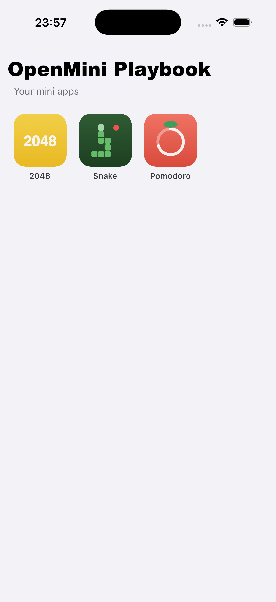
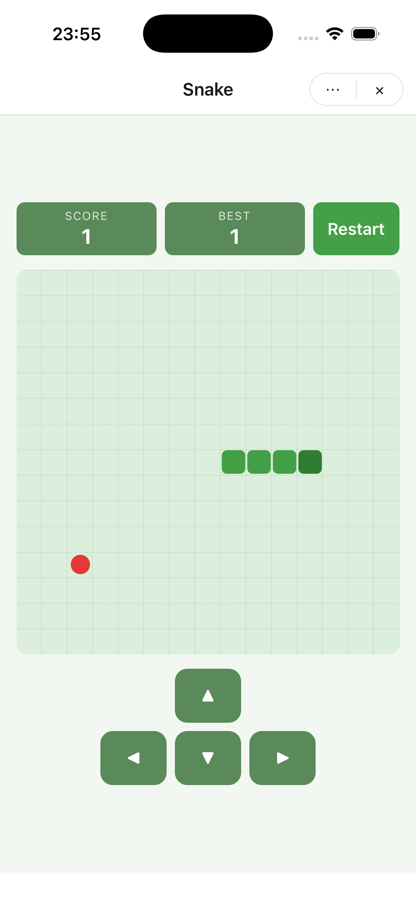
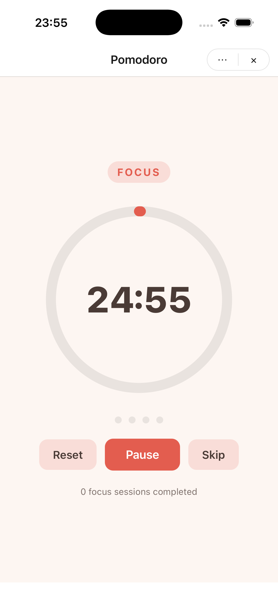

# openmini-playbook

A proof of concept of what using [OpenMini](https://github.com/BoumouzounaBrahimVall/openmini) in a real-life scenario looks like: a **super-app** (the host) that renders a grid of **mini-apps** it discovers at runtime, resolves from a **static registry**, and runs inside verified WebViews over the typed `mini.*` bridge.

This repo contains mini-apps I actually use myself - it's both the playground and the daily driver.

| Super-app | 2048 | Snake | Pomodoro |
| :-------: | :--: | :---: | :------: |
|  |  |  |  |

## What's in here

```
openmini-playbook/
├── mini-apps/            # one folder per mini-app (plain React + Vite + @openmini/runtime)
│   ├── game-2048/        # com.example.game2048  - swipe tiles, reach 2048
│   ├── game-snake/       # com.example.gamesnake - arrows / D-pad snake
│   └── pomodoro/         # com.example.pomodoro  - focus timer with breaks
├── registery/            # static registry + catalog endpoint
│   ├── server.js         # zero-dependency Node static server (CORS, PORT env, default 8300)
│   └── public/           # the served root:
│       ├── apps.json     #   catalog endpoint the super-app fetches
│       └── <appId>/      #   registry layout written by `mini publish`
│           ├── index.json          # version index (latest pointer, sha256 per version)
│           └── <version>/app.mpkg  # the immutable package
└── super-app/
    └── openmini-playbook/        # Expo app (the host) using @openmini/react-native
```

**How the pieces talk:**

1. The super-app reads `EXPO_PUBLIC_APPS_URL` from its `.env` and fetches `apps.json`:

   ```json
   {
     "provider-url": "http://localhost:8300",
     "mini-apps": [
       { "id": "com.example.game2048", "name": "2048", "icon": "<base64 png>" }
     ]
   }
   ```

2. It renders one square card per entry (iOS-home-screen style, skeleton loader while fetching).
3. Tapping a card mounts `<MiniAppProvider registryUrl={provider-url}>` + `<MiniAppView appId={id}>` - the SDK fetches `<appId>/index.json`, downloads the `.mpkg` for `latest`, **verifies its sha256 against the index before extraction**, caches it content-addressed, and runs it in a WebView.
4. Inside, the mini-app talks to the host only through `mini.*` (storage, toast, close, …) gated by its `manifest.json` permissions. The header ✕ calls `mini.navigation.close()`, which dismisses the card.

## Running the POC locally

```bash
# 1. the registry + catalog endpoint
cd registery && npm start                          # http://localhost:8300

# 2. the super-app (needs a dev build - Expo Go is NOT supported)
cd super-app/openmini-playbook
npm install
npx expo run:ios                                   # or run:android
```

> Android emulator note: `localhost` is the device itself - point `.env`'s
> `EXPO_PUBLIC_APPS_URL` *and* `apps.json`'s `provider-url` at
> `http://10.0.2.2:8300` (or your LAN IP for a physical device).

To iterate on a single mini-app without the host: `cd mini-apps/<app> && npm run dev` opens it in a browser mock host.

## Flow: adding a new mini-app

1. **Scaffold** it inside `mini-apps/`:

   ```bash
   cd mini-apps
   npx --package @openmini/cli mini create my-app
   cd my-app && npm install
   ```

2. **Set its identity** in `manifest.json`: a unique reverse-DNS `id` (e.g. `com.example.myapp`), display `name`, `version: 0.1.0`, and only the `permissions` it really needs (`storage`, `toast`, `network` + `allowedDomains`, …). The bridge enforces this manifest at runtime.
3. **Build the app** in `src/` - plain React, any UI library. Talk to the host exclusively through `mini.*` from `@openmini/runtime`. Iterate with `npm run dev` (browser mock host). Give it a mobile shell: full-height layout and a header whose ✕ calls `mini.navigation.close()` so it feels native inside the super-app (copy the pattern from `game-2048`).
4. **Verify**: typecheck/tests, then `npx mini pack` and `npx mini inspect dist/<id>-<version>.mpkg` to validate the package.
5. **Publish to the registry**:

   ```bash
   npx mini publish --registry ../../registery/public
   ```

   This writes `registery/public/<appId>/index.json` + `<version>/app.mpkg` with sha256 hashes.

6. **Add it to the catalog** - append an entry to `registery/public/apps.json`:

   ```json
   { "id": "com.example.myapp", "name": "My App", "icon": "<base64 256px png>" }
   ```

   (The registry protocol has no app listing in v1 - `apps.json` is this repo's own catalog convention, and it's what the super-app renders.)

7. **See it**: relaunch the OpenMini Playbook app - the new card appears in the grid. No host code changes, no app-store release.

## Flow: updating a mini-app (new version)

Packages are immutable; updates are new versions plus a moved `latest` pointer.

1. **Make the changes** in `mini-apps/<app>/src/`, verify with `npm run dev` / tests.
2. **Bump the version** in `manifest.json` (SemVer - e.g. `0.1.0` → `0.2.0`). Keep `package.json` in sync if you like, but `manifest.json` is what ships.
3. **Repack**: `npx mini pack` → `dist/<id>-<newversion>.mpkg`.
4. **Publish** the same way:

   ```bash
   npx mini publish --registry ../../registery/public
   ```

   The registry now holds *both* versions under `<appId>/`, and `index.json`'s `latest` points at the new one. Old packages stay untouched - that's the rollback story: repoint `latest` back if needed.

5. **Ship it**: nothing else. The super-app resolves `latest` on the next open of that mini-app, sees a new sha256, downloads and verifies the new package, and runs it. `apps.json` only changes if the display name or icon changed. Users just get the new version the next time they tap the card.

## Deploying for real

The registry is "a URL layout, not a server" - anything that serves static files works. Deploy `registery/` (or just sync `registery/public/` to an S3 bucket / CDN / GitHub Pages), then update two URLs: `EXPO_PUBLIC_APPS_URL` in the super-app's `.env` and `provider-url` in `apps.json`.

## Publishing to a remote, write-secured registry

The key idea: **reads and writes are two different channels**. The registry protocol only defines the *read* side (public static files); the write side is whatever authenticated mechanism gets files there. Consumers never need write access, so writes can be locked down completely without affecting them.

### Option 1 - S3 (built into the CLI)

```bash
npx mini publish --registry s3://my-bucket/registry
```

- **Reads**: the bucket (or a CloudFront distribution in front of it) serves `/{appId}/index.json` and `/{appId}/{version}/app.mpkg` publicly. That public URL is the `provider-url` - e.g. `https://apps.example.com/registry`.
- **Writes**: publishing requires AWS credentials with a least-privilege IAM policy - `s3:PutObject`/`s3:GetObject` scoped to that prefix only. No credentials → no publish. The write target (`s3://…`) and the read URL (`https://…`) are different addresses for the same content.
- **Immutability**: version packages are never rewritten (`--force` is explicitly dev-only). Enforce it operationally: enable bucket versioning so any overwrite is recoverable, and optionally deny `PutObject` on existing `*/app.mpkg` keys while keeping `index.json` writable - it's the mutable `latest` pointer and must stay writable.

### Option 2 - CI-driven publish (recommended)

Humans never hold write keys; the pipeline does:

1. Merge a change to `mini-apps/<app>/` with a bumped `manifest.json` version.
2. CI runs the app's tests, `mini pack`, `mini inspect` (validation gate).
3. CI runs `mini publish --registry s3://…` using credentials stored as CI secrets - or better, OIDC-federated short-lived credentials, so no long-lived secret exists at all.
4. A follow-up step updates `apps.json` if the name/icon changed.

Write access then reduces to "can you get code through review into main" - usually exactly the trust boundary you want.

### Option 3 - an authenticated upload endpoint on your own server

If you deploy `registery/server.js` and want to push to it directly, add a small write API next to the static reads (the one piece the CLI doesn't do for you):

1. `PUT /publish` accepts the `.mpkg` with a bearer token (kept in a server env var, HTTPS only). No token → 401.
2. The server **re-validates before trusting**: unpacks the manifest, checks `id`/`version`, recomputes the package sha256 - never trusts client-supplied hashes.
3. It refuses to overwrite an existing `{appId}/{version}/app.mpkg` - immutability enforced at the write path, the only place it can be.
4. It writes the package, then atomically rewrites `{appId}/index.json` (temp file + rename) with the new version entry and moved `latest` pointer, so a reader never sees a half-written index.

### Why the integrity story is stronger than it looks

Hosts verify every downloaded package's sha256 **against `index.json` before extraction** - packages are self-verifying once the index is trusted. So the real crown jewel is write access to `index.json`: everything above is ultimately about protecting writes to that one small file. A future hardening step beyond this POC would be signing the index itself, so even the static host doesn't need to be trusted.

For this repo, the minimal real-world setup is Options 1 + 2 combined: sync `registery/public/` to a bucket behind a CDN, publish from CI with scoped credentials, and change just the two URLs above.
